# Jane Street Real-Time Market Data Forecasting

Kaggle Competition  
https://www.kaggle.com/competitions/jane-street-real-time-market-data-forecasting

---

## TL;DR

- Silver medal (top 4.3%) on the Jane Street Real-Time Market Data Forecasting competition with a final private score of **0.007694**.
- Explored sliding-window LightGBM and online-learning pipelines, but the winning submission relies on a static LightGBM ensemble for stability.
- Competition submission blends the static LightGBM ensemble with a teammate-built neural module (`notebooks/submission/submission.ipynb`).
- Reproducible pipeline powered by Polars, Optuna, and `pip install -e .[dev,notebooks]`, plus a synthetic evaluation harness for local stress tests.

---

## Project Overview

This repository chronicles ongoing work on Jane Street’s real-time market forecasting challenge (see `competition-overview.md`). We ultimately earned a silver medal (top 4.3%) with a final private score of **0.007694** by submitting the static LightGBM ensemble captured in `notebooks/submission/submission.ipynb`. The objective remains to predict `responder_6`—a future, weight-adjusted return—using 79 anonymized market features delivered every market minute. Core difficulties include fat-tailed returns, non-stationary behaviour, and sudden regime shifts. While much of the experimentation centres on LightGBM-driven feature engineering and sliding-window training, the static ensemble proved the most reliable in live evaluation, and it blends with a teammate-built neural module inside the submission notebook. Sliding-window LightGBM models still peak around **0.058 weighted R²** on fresh validation windows; typical runs average **0.05 ± 0.01**, and early EDA probes topped out near 0.11 on tiny hold-outs (see `notebooks/eda/EDA_20241224_03.ipynb`).

---

## Repository Layout

- `competition-overview.md`, `dataset-description.md`, `evaluation.xml` capture official background, schema, and scoring formula.
- `notebooks/eda/` – Market diagnostics, correlation heatmaps, distribution studies. See `EDA_20241228_03.ipynb` for responder behaviour and `EDA_20241224_03.ipynb` for high-scoring feature probes.
- `notebooks/experiments/` – Chronological modeling experiments (`YYYYMMDD_##_slug.ipynb`). LightGBM sliding windows dominate, alongside XGBoost and early Torch trials.
- `notebooks/submission/submission.ipynb` – Full submission notebook used by our team: LightGBM modules (authored here) plus teammate-built neural components.
- `images/` – Exported figures referenced in notebooks and this README (heatmaps, tuning traces, SHAP plots, baseline comparisons).
- `main.py` – Simple CLI entry point mirrored by the regression tests.
- `tests/test_main.py` – Pytest check asserting the CLI greeting; cached results live under `.pytest_cache/`.
- `AGENTS.md` – Contributor guide tailored to this repository.
- `pyproject.toml` – Defines installable extras (`dev`, `notebooks`) and feeds `src/janestreet2.egg-info/` packaging metadata (PKG-INFO, SOURCES.txt, etc.).
- `.python-version` – Pins Python 3.13 for local tooling.
- `README_example.md` – Older portfolio-style template retained for reference.
- `src/` – Placeholder for production code once pipelines harden; currently holds `janestreet2.egg-info/` generated by editable installs.
- `tests/` – Seed pytest suite that guards the CLI entry point (`main.py`).

---

## Dataset & Access

`dataset-description.md` documents the official schema. In short, the training set contains ~4.5M rows across 79 features and nine responders. Columns include `date_id`, `time_id`, `symbol_id`, `weight`, `feature_00`–`feature_78`, and `responder_0`–`responder_8` (only `responder_6` is scored). **Data is not stored in this repository**—download it directly from the Kaggle competition page or via the Kaggle CLI:

```bash
kaggle competitions download -c jane-street-real-time-market-data-forecasting
```

Notebooks expect a configurable `path` variable pointing to the folder where you unpack the Parquet files. The committed value (`"I:/Kaggle/jane-street-real-time-market-data-forecasting/"`) is only a placeholder from a Windows workstation; replace it with the directory on your machine, for example `/mnt/storage/jane-street-real-time-market-data-forecasting/`.

The competition runs in two phases: (1) a model-training phase with the historical public set, then (2) a live forecasting phase where the evaluation API streams unseen batches roughly every two weeks. During the live phase you must respond to every timestep, although only rows with `is_scored == True` affect the leaderboard.

Ancillary files (`lags.parquet`, `features.csv`, `responders.csv`) assist with lagged responders and feature metadata. The submission API delivers lagged responders for the previous day at the first time step of each new day, which several notebooks use for online updates.

**Tip:** `notebooks/submission/submission.ipynb` can generate synthetic `test` and `lag` partitions from the training set for local stress testing. Always revert paths back to the real Kaggle inputs before submission.

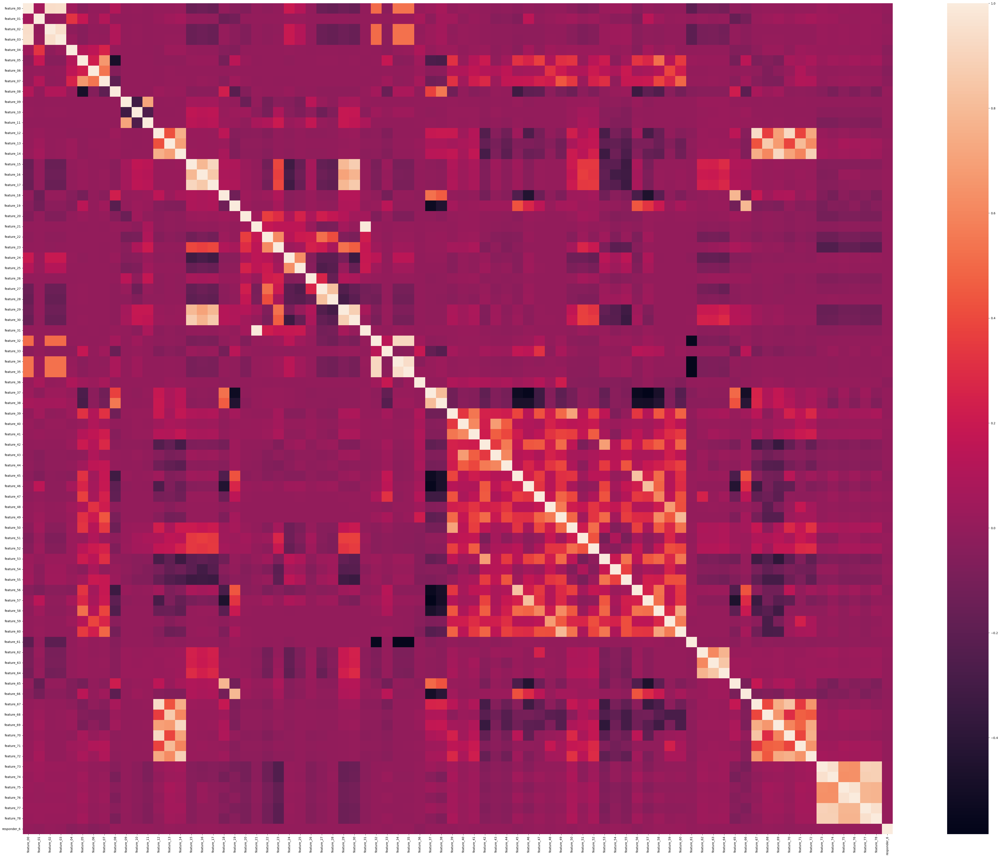

---

## Exploratory Analysis

Early notebooks profile feature stability, feature–target relationships, and cross-feature correlations using Polars for speed.

- **Feature distributions** – `images/feature_00_histogram.png` reveals a bimodal, heavy-tailed shape; `images/feature_09_histogram.png` shows discrete spikes suggesting categorical-like structure; `images/feature_62_histogram.png` highlights an extreme outlier tail near zero. These motivate winsorisation and specialised encoding.
- **Cross-feature correlations** – The `images/features_heatmap.png` matrix illustrates blocks of correlated signals that inform feature grouping and regularisation choices.
- **Temporal drift** – `images/feature_00_pattern_over_time.png` exhibits oscillating means and volatility regimes across `date_id`, while `images/feature_19_pattern_over_time.png` stays comparatively stationary with occasional shocks—input for validation window design.
- **Feature vs. target alignment** – Scatterplots (`images/scatterplot1.png`, `images/scatterplot2.png`) indicate that `responder_6` remains clipped to ±5 and that predictive signals appear as subtle density shifts rather than clear-cut clusters, reinforcing the need for robust modeling.

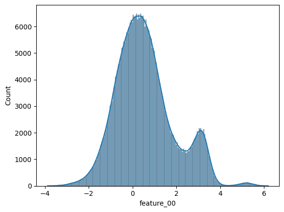
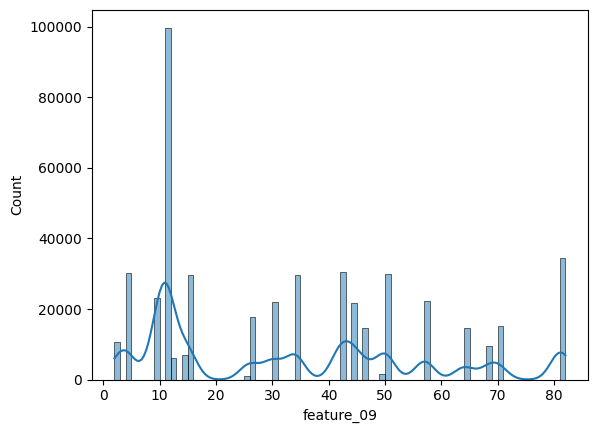
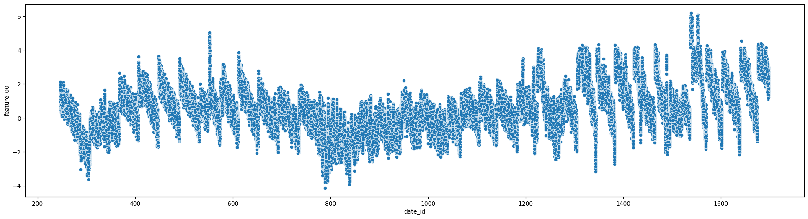
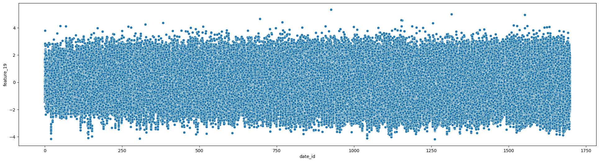
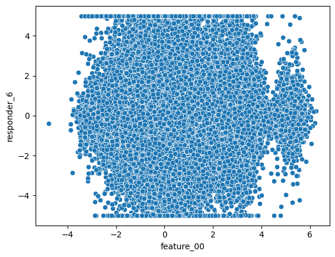
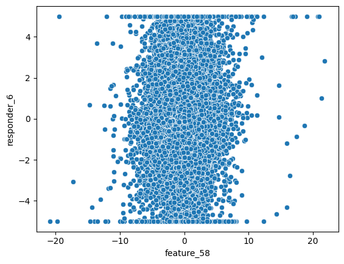

---

## Feature Engineering

Across experiments, I rely on Polars to downcast memory usage (`.shrink_dtype()`), sample large windows, and compute fast aggregations. Common patterns:

- Rolling statistics (mean, std, EWMA) over date/time windows using sliding slices.
- Lag features on key anonymized columns to capture short-term momentum.
- Symbol-aware aggregates (per-symbol averages, volatility proxies) to reduce noise.
- Weight-aware scaling so that training emphasizes high-liquidity observations.

Output features feed directly into gradient-boosted tree models without explicit normalisation; trees handle mixed-scale inputs well.

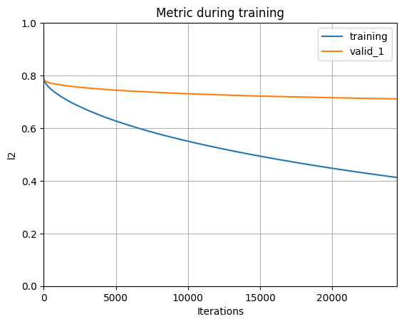  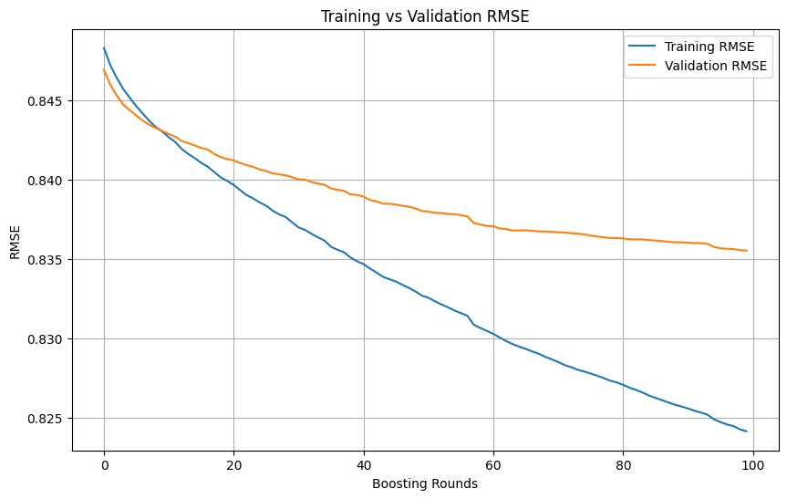

Additional figure assets—`images/feature_00_histogram.png`, `images/feature_09_histogram.png`, `images/feature_62_histogram.png`, `images/feature_00_pattern_over_time.png`, `images/feature_19_pattern_over_time.png`, `images/lgb_optuna_hyperparam_importance.png`, `images/scatterplot1.png`, and `images/scatterplot2.png`—are regenerated directly from their respective notebooks and provide quick visual checks when revisiting experiments.

---

## Modeling Strategy

1. **LightGBM (GPU)** – Primary learner via `LGBMRegressor` with sliding windows (developed here). Each Optuna trial samples a random `date_id`, draws training/validation/test windows (80–300 training days, 1–10 validation days), and evaluates weighted R².
2. **XGBoost** – Serve as benchmarks; XGBoost provides an alternative boosting formulation.
3. **PyTorch prototypes & submission neural module** – Teammate-authored feed-forward and sequence models, later blended with the LightGBM signal in the submission notebook.

Hyperparameter tuning uses Optuna and [OptunaHub](https://optuna.github.io/optunahub/) for remote tracking. Search spaces span learning rate, depth, regularization, and leaf counts. Typical best values fall around `learning_rate≈0.045`, `num_leaves≈2000`, `lambda_l2≈800`.

---

## Validation & Metrics

Validation centers on the competition’s **weighted R²** metric. A helper harness prints scores per window draw; mining notebook outputs shows:

- **497 recorded evaluations** across experiments.
- **Range:** −0.091 to 0.111 weighted R² (small EDA hold-outs hit the upper bound; robust rolling windows cluster between 0.03 and 0.06).
- **Mean:** 0.0139 weighted R² across all quick experiments, underscoring the difficulty of overfitting fast.

To combat leakage:

- Training windows exclude future `date_id`s and avoid overlapping validation ranges.
- High-level embargo strategies are being prototyped to handle closely spaced symbols/timepoints.
- Optuna trials cap training samples (e.g., 500k rows per window) to maintain throughput while keeping temporal ordering.

### Weighted R² Definition

`evaluation.xml` stores the MathML for the official metric. In plain form:

```text
Weighted R² = 1 - (Σ wᵢ (yᵢ - ŷᵢ)²) / (Σ wᵢ yᵢ²)
```

Only rows with `is_scored == True` participate in the sums. Several notebooks materialise helper functions to compute this metric exactly as the API does.

---

## Explainability & Diagnostics

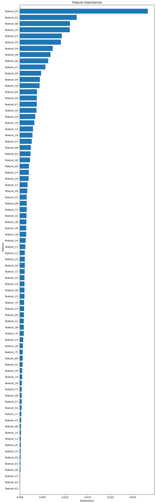
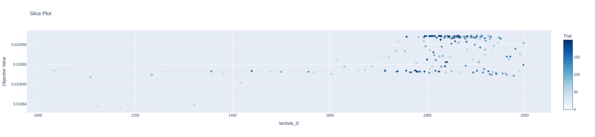
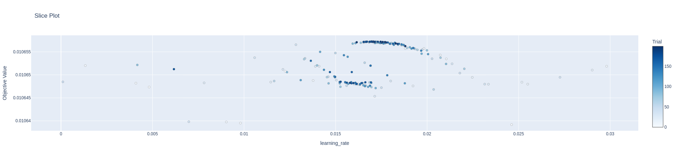

- Feature-importance bar chart (from LightGBM) shows `feature_05`, `feature_03`, `feature_58`, and `weight` as the most influential signals, with a long tail of lower-impact features.
- Optuna slice plots concentrate high-performing trials around `lambda_l2 ≈ 1800–2000` and `learning_rate ≈ 0.017–0.019`, guiding regularisation defaults for future runs.
- Saved artifacts in `images/` provide quick sanity checks when models regress (e.g., comparing baseline vs. tuned curves) and document both LightGBM and neural-network behaviour.

---

## Results Snapshot

| Model & Setup | Validation Window Strategy | Best Weighted R² | Notes |
| --- | --- | --- | --- |
| LightGBM static ensemble (competition submission) | Fixed training span, static features | **0.007694** (private LB) | Silver medal solution in `notebooks/submission/submission.ipynb`; blends static LightGBM with teammate neural module. |
| LightGBM (GPU) + Optuna | 80–300 day training, 1–10 day validation (10 random draws) | **0.0578** | `20250107_01_sliding_window_test.ipynb`; λ₂≈960, sampling 500k rows per draw. |
| LightGBM exploratory EDA | Ad-hoc hold-out (`EDA_20241224_03.ipynb`) | 0.1105 | KFold(shuffle=True); strong overfit warning but guides feature pruning. |
| XGBoost baseline | Static train/validation split | ~0.030 | Provides comparison to ensure LightGBM gains hold. |
| Torch prototype | Dense feed-forward | <0.01 | Requires further feature selection and regularization.

---

## Submission Workflow

`notebooks/submission/submission.ipynb` houses our actual competition submission. It wires the LightGBM/Torch blend into `kaggle_evaluation.jane_street_inference_server.JSInferenceServer`, exercises the API with optional synthetic `test` and `lag` partitions for stress testing, and documents the precise inference path we shipped. Treat it as the authoritative reference for reproducing the team submission.

> ⚠️ Before running locally, redirect input paths back to the real `/kaggle/input/jane-street-real-time-market-data-forecasting/*` files. Synthetic artefacts (`synthetic_test.parquet/`, `synthetic_lag.parquet/`) are for debugging only.

### Notebook Inventory

All notebooks live under `notebooks/` and are grouped by purpose:

- **Exploratory Data Analysis (`notebooks/eda/`)** – `EDA_20241221_01.ipynb`, `EDA_20241222_{01..05}.ipynb`, `EDA_20241223_{01,02,04}.ipynb`, `EDA_20241224_{01..04}.ipynb`, `EDA_20241225_02.ipynb`, `EDA_20241226_01.ipynb`, `EDA_20241228_{01..03}.ipynb`, `EDA_20241229_07.ipynb`, `EDA_20241231_01.ipynb`.
- **Model Experiments (`notebooks/experiments/`)** – From early baselines (`20241223_03_knnimputer.ipynb`, `20241225_01_polars.ipynb`, `20241227_01_baseline.ipynb`) through the sliding-window series (`20250107_{01..04}_sliding_window*.ipynb`, `20250110_{01..06}_fast_model*.ipynb`), online-learning runs (`20250105_{01..12}_*.ipynb`), lag creation (`20250101_01_lags.ipynb`, `20250102_{01,02}_*.ipynb`), GPU tests (`20241227_02_gpu_test.ipynb`), Torch prototype (`20241230_02_pytorch.ipynb`), and long-horizon validation studies (`20250112_{01..04}_*.ipynb`, `20250113_01_last_180_days_for_test_3.ipynb`).
- **Submission Harness (`notebooks/submission/submission.ipynb`)** – described above.

---

## How to Reproduce

1. **Set up environment**
   ```bash
   python -m venv .venv
   source .venv/bin/activate
   pip install -e .[dev,notebooks]
   ```
2. **Download data** from Kaggle and unpack the Parquet files, updating the notebook `path` variable to match your location.
3. **Launch JupyterLab** and open notebooks chronologically; begin with EDA to regenerate figures, then experiment notebooks for modeling runs.
4. **Track tuning** with Optuna Dashboard when running long sweeps:
   ```bash
   optuna-dashboard sqlite:///optuna.db
   ```
5. **Run tests** before committing changes: `pytest -q`.

---

## Key Learnings & Challenges

- Live trading constraints reward stability: sliding-window models reached **0.058 weighted R²** in validation, but a well-regularised static LightGBM ensemble proved more reliable for the live API.
- Rich tooling mattered: Polars kept 4.5M-row feature engineering manageable, and Optuna/OptunaHub let us iterate quickly across 70+ experiments.
- Blending requires tight collaboration: the final submission stitches my LightGBM models with a teammate’s neural module, so artifact management and interface design were as important as raw model accuracy.

---

## Next Steps

- Integrate richer temporal encoders (Transformer-style sequence models) to exploit minute-level structure.
- Formalise online learning notebooks into a reusable pipeline under `src/`.
- Automate feature importance drift monitoring based on SHAP outputs to detect leakage early.
- Explore ensembling (LightGBM + XGBoost) and stacking with linear meta-learners for leaderboard submissions.
- Productionise environment setup with Makefiles or UV workspaces for repeatable training runs.

---

## Acknowledgements

- **Jane Street & Kaggle** for releasing the competition data, infrastructure, and evaluation API.
- **Open-source contributors** behind LightGBM, XGBoost, Optuna, Polars, PyTorch, and the broader Python ecosystem.
- **Community notebooks** that inspired experiments, especially baseline sliding-window ideas and API harness patterns referenced in this repo.

---

## License

This project is shared under the terms of the [MIT License](LICENSE). Review Jane Street’s competition rules for any additional constraints when using the data or derived insights.

---

## Contributing

See `AGENTS.md` for contributor guidelines covering environment setup, coding style, testing expectations, and data hygiene.
